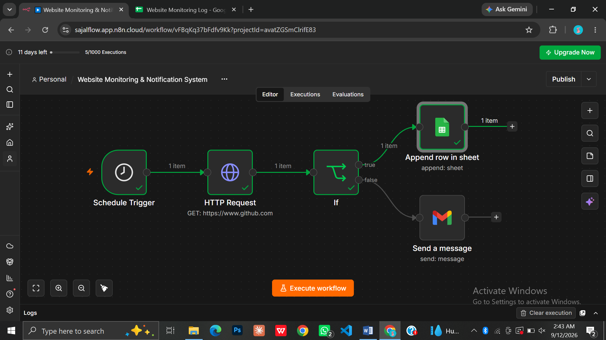
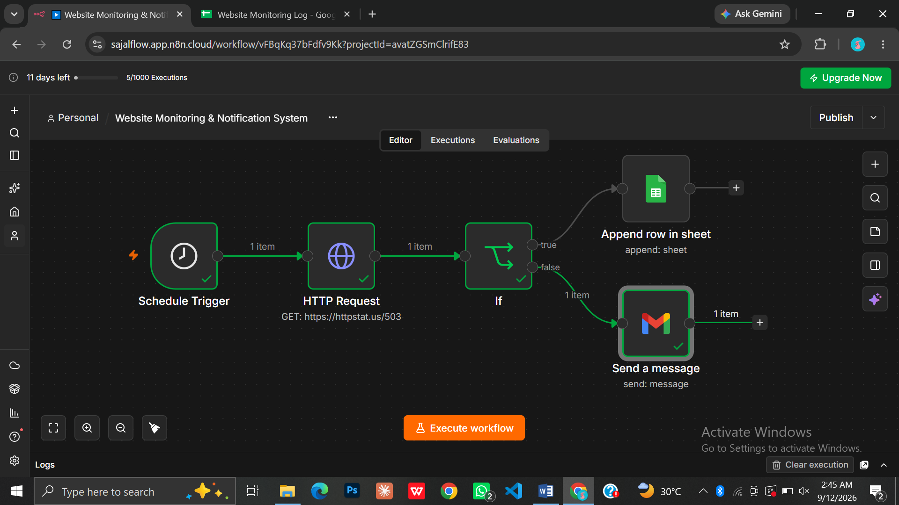
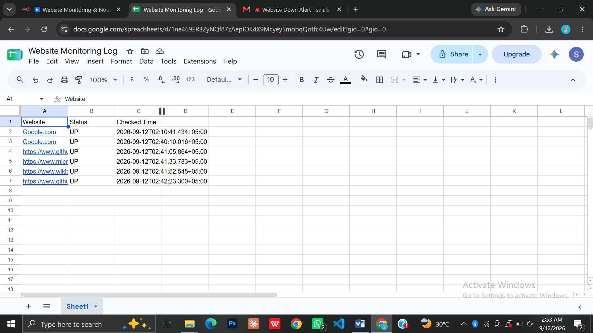
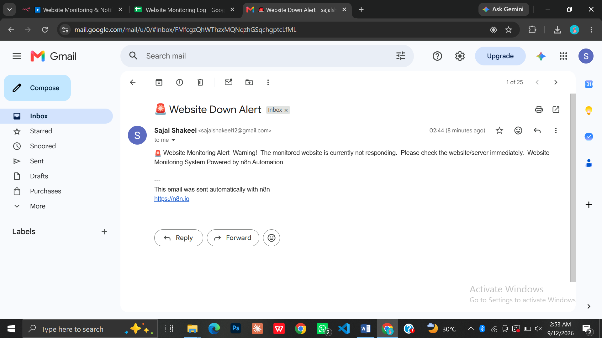

# n8n Website Monitoring & Notification System

An automated website monitoring workflow built with n8n that checks website availability, evaluates the response status, stores monitoring results in Google Sheets, and sends automated Gmail alerts when a website becomes unavailable.

## Overview

This project demonstrates a simple website monitoring and notification workflow using n8n.

The workflow runs automatically on a schedule and checks the selected website using an HTTP Request. The response is then evaluated using conditional logic and separated into two paths:

- Website Available
- Website Unavailable

When the website is available, the monitoring result is stored in Google Sheets.

When the website is unavailable, an automated Gmail alert is sent to notify the recipient.

## Workflow

Schedule Trigger
↓
HTTP Request
↓
Check Website Status
↓
├── Website Available → Google Sheets Monitoring Log
│
└── Website Unavailable → Gmail Website Down Alert

## Key Features

- Automated website availability monitoring
- Scheduled workflow execution
- Website status checking using HTTP Request
- Conditional processing based on website response
- Automatic Google Sheets monitoring records
- Automated Gmail downtime notifications
- Separate handling for available and unavailable websites
- Workflow-based website monitoring

## Technologies Used

- n8n
- Schedule Trigger
- HTTP Request
- IF Condition
- Google Sheets
- Gmail
- Conditional Logic
- Workflow Automation

## Workflow Structure

### 1. Schedule Trigger

Starts the website monitoring workflow automatically according to the configured schedule.

### 2. HTTP Request

Checks the availability of the selected website and receives its HTTP response.

### 3. Check Website Status

The workflow evaluates the HTTP response using conditional logic and determines whether the website is available or unavailable.

### 4. Website Available

When the website meets the configured availability condition, the workflow follows the TRUE path and records the monitoring information in Google Sheets.

### 5. Website Unavailable

When the website does not meet the availability condition, the workflow follows the FALSE path and sends an automated Gmail notification.

### 6. Google Sheets Monitoring Log

The monitoring result is stored in Google Sheets with information such as the website, status, and checked time.

### 7. Gmail Website Down Alert

When the website is unavailable, Gmail is used to send an automated notification so the issue can be checked.

## Project Files

- `workflow/` — Contains the exported n8n workflow JSON.
- `screenshots/` — Contains workflow execution, monitoring log, and email alert screenshots.
- `docs/` — Contains the project documentation.
- `README.md` — Project documentation.

## Screenshots

Project workflow and execution evidence are available in the `screenshots/` folder.

The screenshots include:

- Website UP / TRUE branch
- Website DOWN / FALSE branch
- Google Sheets monitoring log
- Website Down Gmail alert

## How to Use

1. Import the workflow JSON file into n8n.
2. Configure your Google Sheets credentials.
3. Configure your Gmail credentials.
4. Review the website URL and monitoring condition.
5. Test the workflow with an available website.
6. Verify the monitoring result in Google Sheets.
7. Test the unavailable website path.
8. Verify the Gmail notification.

## Testing

The workflow was tested using both website availability scenarios.

### Website UP Test

A working website returned a successful response and the monitoring result was recorded in Google Sheets.

### Website DOWN Test

A simulated unavailable website response triggered the Gmail alert successfully.

## Notes

This project was developed as a practical automation project to demonstrate website monitoring, HTTP request handling, conditional processing, data logging, and automated notifications using n8n.

## Workflow

